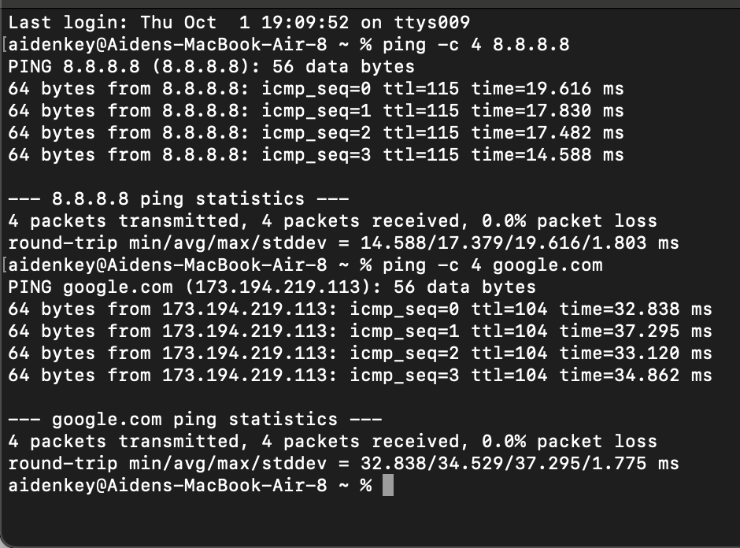
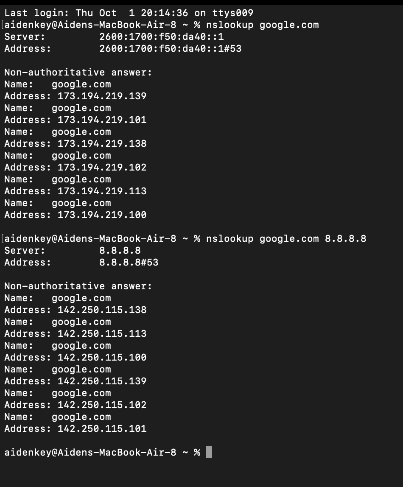
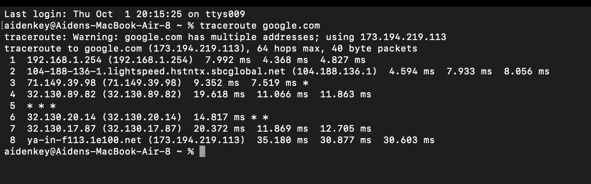

# network-troubleshooting-lab
Hands-on network connectivity and DNS troubleshooting lab using macOS networking utilities

# Objective
The purpose of this lab was to practice identifying and troubleshooting common network connectivity issues on macOS. I used command-line networking tools to test local connectivity, internet connectivity, DNS resolution, and network paths

# Environment
* macOS
* Wi-Fi network
* TCP/IP
* IPv4
* DNS
* DHCP

# Tools Used
* ping
* nslookup
* traceroute
* route
* ipconfig
* ifconfig
* scutil

# Troubleshooting Methodology
I used a step-by-step troubleshooting process to isolate where a network connection was failing.
1. Identify the default giveaway
2. Test connectivity to the local gateway
3. Test connectivity to an external IP address
4. Test connectivity to a domain name
5. Test DNS resolution when necessary
6. Trace the network path to a destination when necessary
7. Inspect IP address, subnet mask, DNS, and DHCP configuration
8. Apply the appropriate fix based on the identified problem
9. Retest connectivity and verify that the original issue is resolved

# Basic Troubleshooting Logic
Gateway unreachable -> Investigate local network or IP configuration

Gateway reachable but external IP unreachable -> Investigate internet or upstream connectivity

External IP reachable but domain names fail -> Investigate DNS

Default DNS fails but an alternate DNS server works -> Investigate the configured DNS server or DNS settings

# Hands-On Testing
### Identifying Network Configuration
I first identified my Mac's default gateway and local IP address. This allowed me to understand the local network configuration before beginning connectivity tests. 
Commands used: 
route -n get default

ipconfig getifaddr en0

I identified my default gateway and local IPv4 address to establish the device's local network configuration before testing connectivity

### Testing Local and Internet Connectivity
I used ping to test connectivity at different points in the network.

I first pinged the default giveaway to verify that my Mac could communicate with the local network. I then pinged 8.8.8.8 to test connectivity to an external IP address without relying on DNS.

Commands used:

ping -c 4 (IP Address)

ping -c 4 8.8.8.8

Successful responses from both tests showed that my Mac could communicate with the local gateway and reach the internet.

### Testing DNS Resolution

I used nslookup to test whether DNS could translate domain names into IP addresses. This helped distinguish DNS problems from general internet connectivity problems.

Commands used:

nslookup google.com

nslookup google.com 8.8.8.8

The first command tested DNS resolution using my configured DNS server. The second command queried Google's public DNS server directly. Comparing these results can help determine whether a connectivity problem is caused by the device's configured DNS server.

### Tracing Network Paths

I used traceroute to view the path traffic took from my Mac to an external destination.

Command used:

traceroute google.com

The traceroute displayed responding network hops between my local network and the destination along with round-trip times. I also observed that an asterisk at an individual hop does not necessarily indicate a failed connection because some routers may not respond to traceroute probes while continuing to forward traffic.

## Simulated Troubleshooting Scenarios

### Scenario 1: Upstream Connectivity Failure

**Problem:** A device was connected to Wi-Fi but could not access the internet.

**Testing:**
- Verified the device could reach its default gateway.
- Attempted to ping an external IP address.
- Confirmed that multiple devices on the same network were experiencing the same issue.

**Diagnosis:** The local network was functioning, but devices could not reach the internet, indicating an upstream connectivity problem.

**Resolution:** The networking equipment was restarted and external connectivity was restored. Connectivity was retested after the change to verify the issue was resolved.

### Scenario 2: DNS Resolution Failure

**Problem:** A device could reach external IP addresses but websites would not load by domain name.

**Testing:**
- Successfully pinged `8.8.8.8`.
- Used `nslookup` with the configured DNS server, which failed to resolve the requested domain.
- Queried `8.8.8.8` directly as an alternate DNS server and successfully resolved the domain.

**Diagnosis:** Internet connectivity was functioning, but the configured DNS server was not resolving domain names.

**Resolution:** The DNS configuration was changed to a functioning DNS server. I then verified DNS resolution and confirmed that the original website loaded successfully.

### Scenario 3: Incorrect Static IPv4 Configuration

**Problem:** A device showed that it was connected to Wi-Fi but could not reach its default gateway or the internet.

**Testing:**
- Identified the default gateway.
- Attempted to ping the gateway and received no response.
- Inspected the device's IPv4 address and subnet mask.
- Determined that the manually configured IPv4 address was on a different subnet from the default gateway.

**Diagnosis:** An incorrect manually configured IPv4 address prevented the device from communicating properly with the local network.

**Resolution:** IPv4 configuration was returned to DHCP so the device could automatically obtain valid network settings. I then verified connectivity to the gateway, internet, and original website.

### Scenario 4: Managed Device Web Filtering

**Problem:** A company-managed device could access work-related websites but several non-business websites would not load.

**Testing:**
- Verified connectivity to the default gateway and internet.
- Verified DNS resolution.
- Confirmed that work-related websites loaded successfully.
- Compared behavior with a personal device on the same network.
- Confirmed with the organization's IT team that web filtering was enabled.

**Diagnosis:** The network was functioning normally. Website access was being intentionally restricted by organizational policy.

**Resolution:** No technical remediation was required. The user was directed to the appropriate IT team for questions or legitimate access requests.

## Lab Evidence

### Connectivity Testing

The following test verifies connectivity to an external IP address and a domain name.

### DNS Resolution Testing

The following tests compare DNS resolution using the configured DNS server and Google's public DNS server.

### Network Path Analysis

The traceroute below displays the network path to an external destination. Some intermediate hops did not respond to every probe, while the destination was still successfully reached.

## What I Learned

Through this lab, I developed a better understanding of how devices communicate across local networks and the internet. I learned how default gateways, IPv4 addressing, subnet masks, DHCP, and DNS work together to provide network connectivity.

I also learned how to use command-line tools such as `ping`, `nslookup`, and `traceroute` to isolate connectivity problems rather than immediately attempting random fixes. By testing connectivity at different points in the network, I was able to distinguish between local network issues, upstream connectivity problems, DNS failures, and expected network restrictions.

Most importantly, this lab helped me develop a structured troubleshooting process: identify the problem, gather information, isolate the cause, apply an appropriate solution, and verify that the original issue has been resolved.

## Future Improvements

- Practice troubleshooting additional network configuration issues
- Explore packet analysis using Wireshark
- Expand the lab using virtual machines and additional operating systems
- Document additional troubleshooting scenarios as I gain experience
